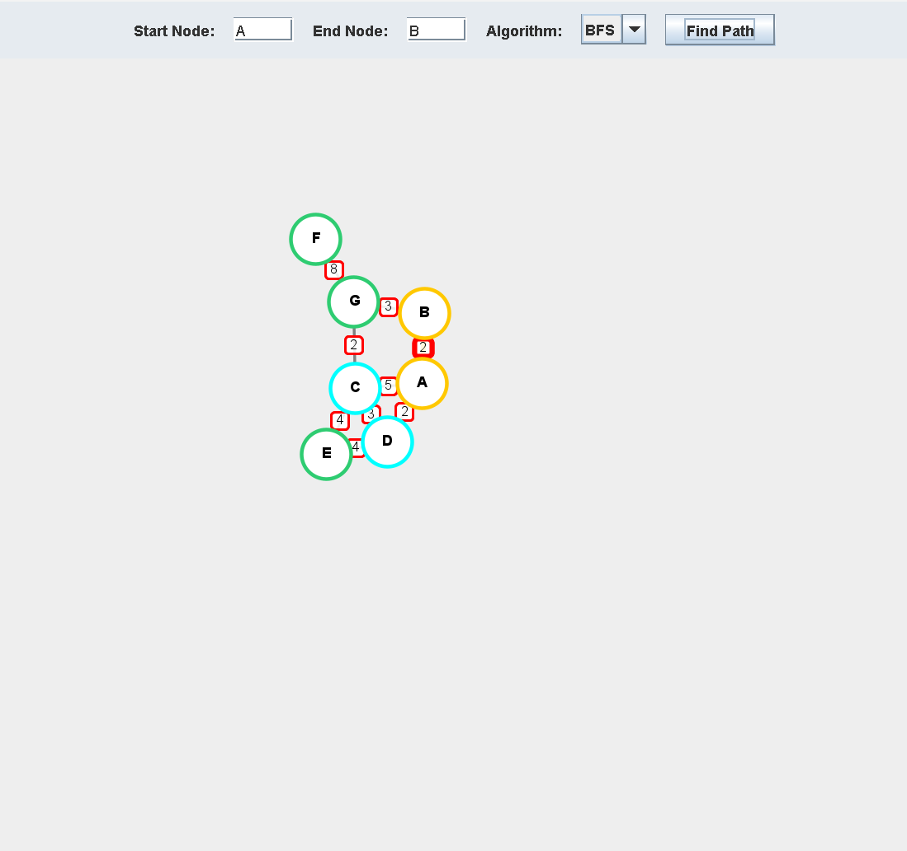
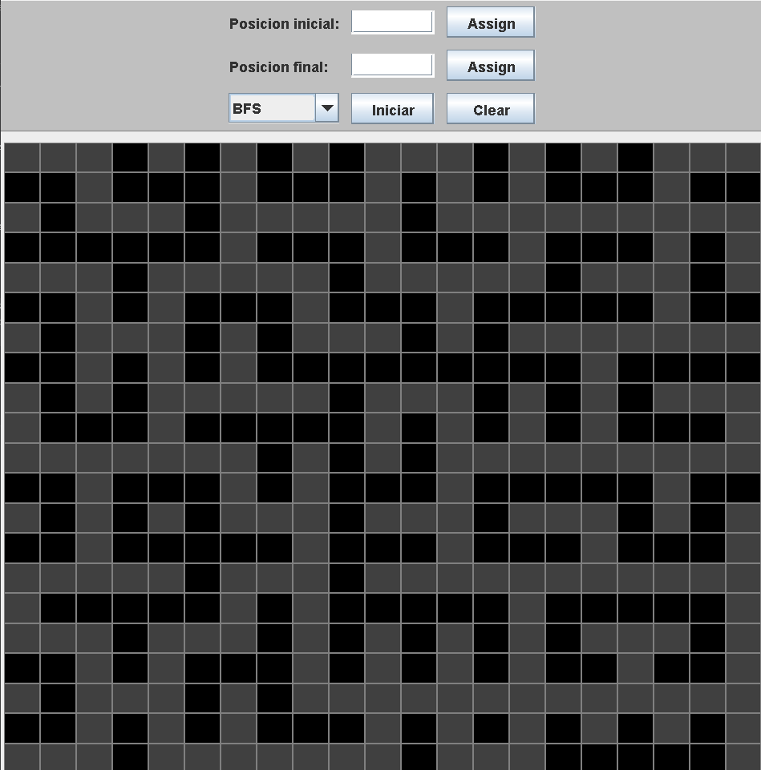

# Ejercicio de Algoritmos de Búsqueda

Proyecto desarrollado en Java que implementa los algoritmos de búsqueda **BFS**, **DFS**, **UCS** y **A*** sobre grafos y laberintos. Incluye visualización gráfica mediante Swing y lectura de datos desde archivos CSV.

### Parentesis:

> La explicacion de los algoritmos, del codigo y demas... Se encuentran en la carpeta de "`finder/doc/*`"

## Características

* Implementación de BFS (Breadth-First Search).
* Implementación de DFS (Depth-First Search).
* Implementación de UCS (Uniform Cost Search).
* Implementación de A* (A-Star).
* Visualización gráfica de grafos.
* Visualización gráfica de laberintos.
* Carga de datos desde archivos CSV personalizados.
* Animación del recorrido realizado por cada algoritmo.

---

# Requisitos

## Software necesario

* Java 17 o superior.
* Maven 3.8 o superior.

---

# Ejecución

Desde la carpeta raíz del proyecto (`finder`):

## Primera ejecución

```bash
mvn compile
mvn exec:java "-Dexec.mainClass=main.Solvers.Main"
```

## Ejecuciones posteriores

```bash
mvn exec:java "-Dexec.mainClass=main.Solvers.Main"
```

---

# Manual de uso

## Menú principal

Al iniciar el programa se mostrará un menú en la terminal:

```text
========================================
Manual de uso en README.md

¿Que tipo de estructura desea indagar?
[0] : Grafo
[1] : Laberinto
========================================
```

Opciones disponibles:

* `0` → Analizar grafos.
* `1` → Analizar laberintos.

---

## Selección de archivos CSV

Después de elegir el tipo de estructura, se mostrará una lista con los archivos CSV disponibles.

Ejemplo:

```text
========================================
Seleccione el archivo que desea aplicar al algoritmo:

[0] Graph1.csv
[1] Graph2.csv
[2] Graph3.csv
========================================
```

---

## Agregar archivos personalizados

Los archivos CSV deben ubicarse en:

```text
src/main/resources/CSVs/
```

y dentro de una de las siguientes carpetas:

```text
Graphs/
Mazes/
```

### Formato para grafos

```csv
Source;Target;Weight
A;B;2
A;C;5
A;D;2
B;G;3
C;D;3
C;E;4
C;G;2
D;E;4
G;F;8
```

### Formato para laberintos

```csv
0;0;0;1;0;0;0
0;0;0;1;0;0;0
0;0;0;1;0;0;0
0;0;0;0;0;0;0
0;0;0;1;0;0;0
...
```

### Recomendación

Se recomienda generar los archivos CSV utilizando Excel u otra herramienta similar y exportarlos directamente en formato CSV.

---

# Interfaz de Grafos

Una vez seleccionado un archivo de grafos, se abrirá una ventana de visualización.



## Funciones disponibles

### Selección de nodos

* Start Node → Nodo inicial.
* End Node → Nodo objetivo.

### Selección de algoritmo

* BFS
* DFS
* UCS
* A*

### Ejecución

Presione **Find Path** para iniciar la búsqueda.

Se mostrará una animación que representa el recorrido realizado por el algoritmo.

Para realizar una nueva búsqueda basta con cambiar los parámetros y volver a presionar **Find Path**.

## Información mostrada en consola

Dependiendo del algoritmo seleccionado se mostrará:

* Costo total del camino.
* Cantidad de nodos del camino encontrado.

---

# Interfaz de Laberintos

Una vez seleccionado un archivo de laberinto, se abrirá la ventana correspondiente.



## Configuración de posiciones

Las coordenadas utilizan el formato:

```text
fila,columna
```

Ejemplos:

```text
0,20
20,0
```

Donde `(0,0)` corresponde a la esquina superior izquierda del laberinto.

## Algoritmos disponibles

* BFS
* DFS
* UCS
* A*

## Ejecución

* **Asignar** → Guarda las posiciones inicial y final.
* **Iniciar** → Ejecuta el algoritmo seleccionado.
* **Clear** → Limpia la visualización actual.

## Información mostrada en consola

* Confirmación de si se encontró un camino.
* Longitud del camino encontrado.

---

# Dependencias

El proyecto utiliza las siguientes librerías:

* Apache Commons CSV
* Lombok

---

# Observaciones

* Para cargar un nuevo archivo CSV es necesario reiniciar la ejecución del programa.
* Los algoritmos BFS y DFS ignoran los pesos de las aristas.
* UCS y A* consideran los costos definidos en el grafo.
